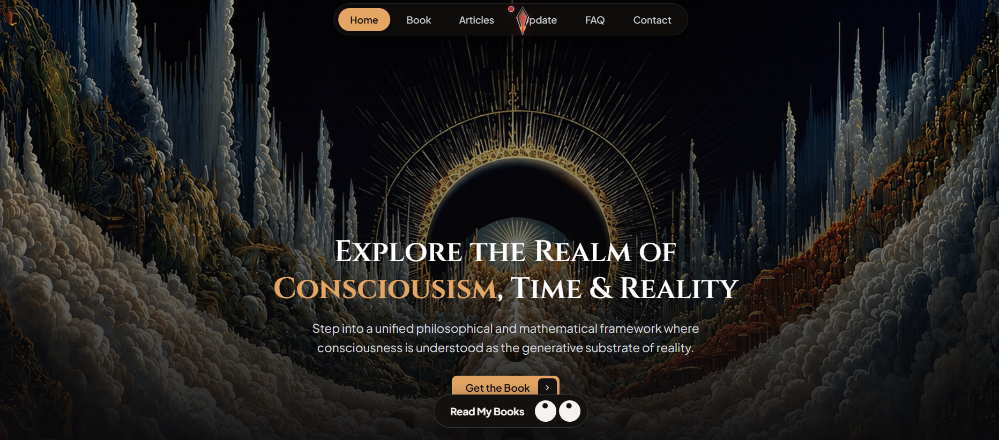

# Consciousism — Author Website & Content Management Portal

A responsive web application and content management platform designed to showcase the philosophical framework of **Consciousism** (by Clovis), featuring a reader-facing website alongside a dedicated **Admin Dashboard** for managing subscriber messages and site updates.



---

## 🌌 Overview

This project serves as both an immersive portal for readers exploring the book *Consciousism* and a lightweight backend management system for the author to handle updates and communications.

### Key Features

* **Public Site:**
  * **Interactive Hero & Navigation:** Smooth layout covering **Home**, **Book**, **Articles**, **Updates**, **FAQ**, and **Contact**.
  * **Call-to-Actions:** Direct conversion links for book purchases and reader engagement.
  * **Responsive UI:** Dark-mode visual architecture designed across screen sizes.

* **Admin Portal & Backend Controls:**
  * **Email & Message Center:** Interface to view, organize, and respond to incoming reader inquiries submitted via the contact form.
  * **Content & Announcement Updates:** Panel to create, edit, and publish site updates, article links, and announcements in real time.
  * **Authentication:** Secure admin access control for dashboard features.

---

## 🛠️ Tech Stack

* **Frontend:** HTML5, CSS3, JavaScript (ES6+)
* **Admin & Backend:** Node.js / Express (or dynamic server setup) & Database Integration (for storing messages/updates)
* **Email Integration:** Nodemailer / Webhook Service for handling contact form submissions

---

## 🚀 Getting Started

### Prerequisites
* Node.js (v16+)
* npm or yarn

### Installation

1. **Clone the repository:**
   ```bash
   git clone [https://github.com/your-username/repository-name.git](https://github.com/your-username/repository-name.git)
   cd repository-name